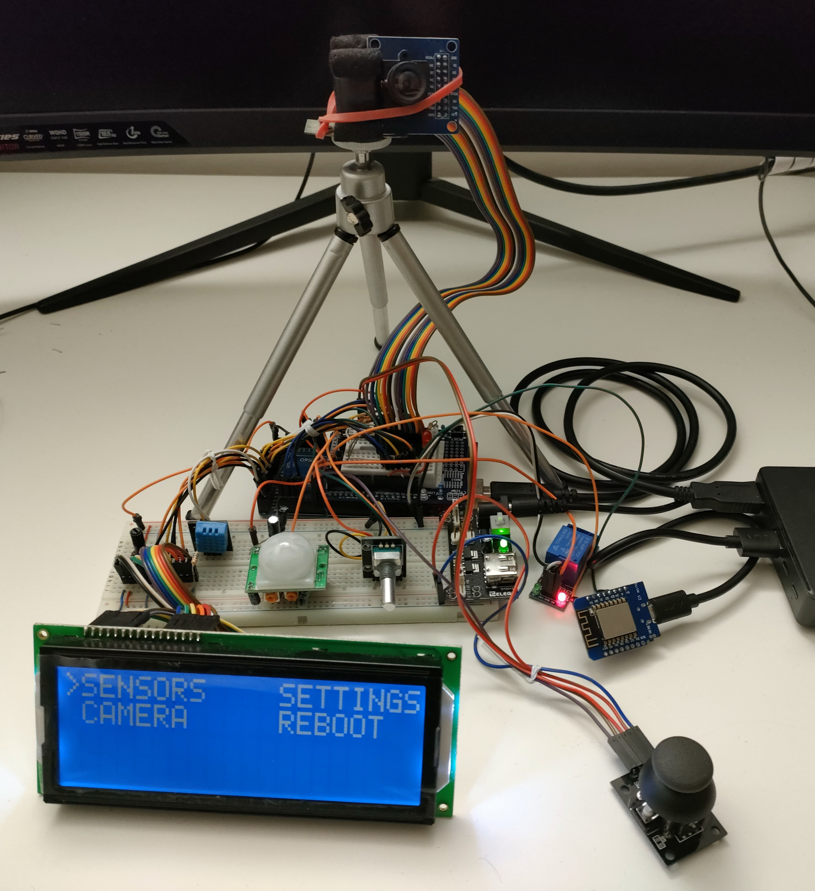
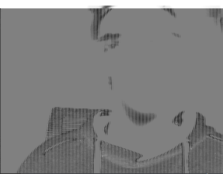
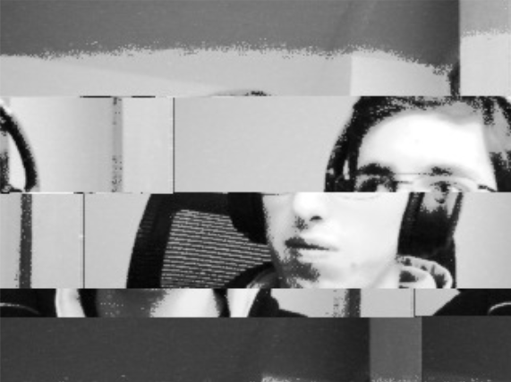
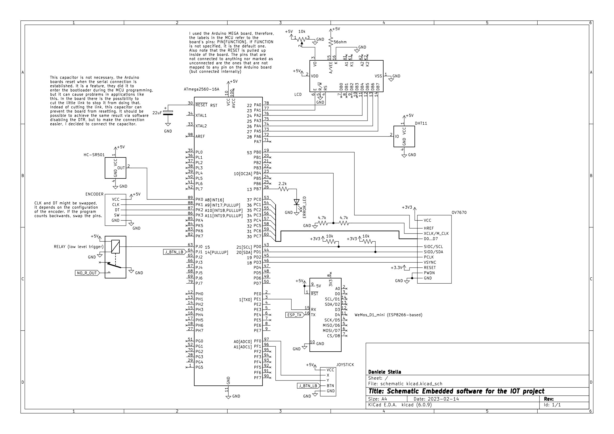

# Embedded Software for the IoT course project

| Members        | Mail |
|--|--|
| Daniele Stella | daniele.stella@studenti.unitn.it |

<p align="center">

</p>

## Table of contents
- [About this project](#about-this-project)
- [Documentation](#documentation)
  - [Libraries documentation](#libraries-documentation)
  - [Error codes meaning](#error-codes-meaning)
  - [Serial communication](#serial-communication)
- [Known issues](#known-issues)
- [Project Layout](#project-layout)
- [Requirements](#requirements)
  - [Hardware Requirements](#hardware-requirements)
  - [Software requirements](#software-requirements)
- [Schematic](#schematic)
- [Software architecture and Working Scheme](#software-architecture-and-working-scheme)

## About this project
I wanted to create a real-word IoT application but have the chance to learn how everything works under the hood. I created a small smart home control panel. There are some sensors to measure temperature and humidity, and to detect motion. There is a camera module which captures images that are either sent to a web server (hosted on the microcontroller) or to a general device connected via serial. The interaction with the user is done via a LCD display, a joystick and an encoder. I used two microcontrollers:

* ESP8266: hosts the a webserver on the port 80 and a WebSocket on the port 81. It is programmed in C++.
* ATmega2560: does everything else, it handles all the sensors. It is programmed bare-metal in C without any component libraries.

The [powerpoint presentation [IT WILL BE ADDED SOON]](./) for the oral exam is in the main folder.

The pitch video demonstration can be found <a href="https://youtu.be/KyKZRw-Gbsg">here</a>.
<p align="right">(<a href="#top">Back to top</a>)</p>

## Documentation
### Libraries documentation
I did not make a documentation for the libraries I created for the components connected to the ATmega2560. However, the entire code is commented and self-contained. The header files contain the comments about what the functions do, the source code files contain the comments about how everything was implemented. See [Software architecture and Working Scheme](#software-architecture-and-working-scheme) for the most important information.

### Error codes meaning
If the board encounters an error, it enters an error state. In this error state, all the peripherals are turned off (even the internal ones), the red LED blinks and the error is displayed on the LCD display. Here's what each error code means:
| ERROR CODE | ADDITIONAL INFO | Cause |
|--|--|--|
| 0 | 0 | General error |
| 1 | 0 | Camera TWI start error |
| 1 | 1 | Camera TWI write error |
| 1 | 2 | Camera TWI send address error |
| 2 | 0 | Camera error |
| 3 | 0 | ADC selection error |
| 4 | 0 | DHT11 error |
| 4 | 100 | DHT11 start pull low error |
| 4 | 101 | DHT11 start pull high error |
| 4 | 102 | DHT11 transmit start bit error |
| 4 | 103 | DHT11 transmit error |
| 4 | 104 | DHT11 EOF pull low error |
| 4 | 105 | DHT11 checksum error |
| 5 | 0 | Unexpected state error |
| 6 | 0 | Unexpected joystick direction error |

### Serial communication
The ATmega2560 sends the raw image on the UART0 at 1,000,000 of baud rate. It is possible to connect it to any device that supports the UART communication. For instance, in the pitch video linked above, I used a raspberry pi 3b+ to demonstrate this. The Python script I used can be found in the ["Scripts"](./Scripts) folder. I uploaded the version that I used for debugging on Windows, but with small changes it can be adapted for Linux or scale the PyGame window to fullscreen. That script was developed for debugging purposes, it surely is not efficient. In that folder there is also a small script to easily detect what port the board is connected to.

<p align="right">(<a href="#top">Back to top</a>)</p>

## Known issues
The project is not perfect. There are still some issues that I did not have time to fix. The following list includes all the problems that I have encountered during all the tests that I carried out:
* The first one or two images captured by the camera tend to be a little overexposed. It does not always happen, but most times it does. I still have to understand if it is because of the camera sensor or if I can do something about it changing some of the parameters I send to the camera in the setup routine.
* Sometimes the camera data is bugged, like there was an additional pixel that should not exist that unbalances the entire image. My guess is that it is some kind of communication problem caused by some interference or crosstalk between the wires as I have a ton of wires packed. So far, the only fix for this is to reset the board (or enter the reboot state). The images in this case look something like this:
<p align="center">

</p>

* The ESP8266 with the program that I developed is not quite fast enough to send the incoming data in time. It works, but sometimes one of the two buffers has not been sent yet and it get overwritten. I tried everything I could think of. This is why I am using the WebSocket with two alternating buffers, is does a better job compared to everything else I tried but it still is not even close to perfect. A simple way to fix this issue would obviously be to reduce the baud rate, but I did not want to do it because it then talkes way too long to transfer the image. For this reason, the image sent to the client might look like this:
<p align="center">

</p>

<p align="right">(<a href="#top">Back to top</a>)</p>

## Project Layout

```
├── Code                    # PlatformIO project folder for the ATmega2560
|   ├── include             # All the header files
|   └── src                 # All the source code files
├── Components_tests        # Tests
|   ├── Rapid_prototyping   # Tests done with Arduino IDE using an Arduino UNO
├── Schematic_kicad         # KiCad 6.0 project folder, includes the PDF
├── Scripts                 # All the Python scripts
└── Web_server              # Arduino IDE project folder
```
<p align="right">(<a href="#top">Back to top</a>)</p>

## Requirements
### Hardware Requirements
#### MCUs
* ATmega2560 - I used the Arduino MEGA board: additional hardware is required if you do not use the Arduino board.
* LOLIN(WEMOS) D1 mini (clone), ESP8266-based. The code works also on a generic ESP8266 board. 

#### Main components
* OV7270 - Camera module
* DHT11 - Humidity and Temperature sensor
* Encoder
* HC-SR501 - PIR sensor
* Joystick
* LCD display

#### Other components
* LED
* Relay

#### Others
* Resistors (10k, 56, 2.2k, 4.7k)
* Potentiomiter (10k)
* Capacitor (2.2uF)
* Breadboard, wires
* Proto Shield (optinal, I used it to easily organize the camera wiring)

### Software requirements
The software requirements are different for the two MCUs:

#### ATmega2560:
I used the PlatformIO IDE extension for Visual Studio Code, the ["Code"](./Code) folder is the project's folder, open it with VS Code via that extension. I did not rely on anything special, I only imported some of the ```avr/``` and ```util/``` header files. Therefore, you do not actually need to use this environment. You can open the folder with any IDE that supports the ATmega2560, for instance Atmel Studio, and everything will work. Obeviously, it will be necessary to move all the header files and source code files in the same directory, or change the preprocessor directives.

#### LOLIN(WEMOS) D1 mini (clone), ESP8266-based:
I used Arduino IDE since I needed to use the libraries to host the web server and the WebSocket. 
First of all, to add the ESP boards to the IDE it is necessary to add this URL to the settings on the "Additional boards manager URLs": ```http://arduino.esp8266.com/stable/package_esp8266com_index.json```.

I used the following libraries:
* ESP8266WiFi by Ivan Grokhotkov
* ESP8266WebServer by Ivan Grokhotkov
* WebSockets by Markus Sattler (I downloaded it from <a href="https://www.arduinolibraries.info/libraries/web-sockets">here</a>, and added the ```.zip``` to the IDE)

<p align="right">(<a href="#top">Back to top</a>)</p>

## Schematic
I created the schematic with KiCad 6.0, the project files can be found in the ["Schematic_kicad"](./Schematic_kicad) folder. There is also the exported [PDF](./Schematic_kicad/schematic.pdf) there. In the schematics there are some additional information, for instance, the respective pin numbers on the Arduino board for the MCU's pins, and those pins' selected function. Here's a preview of it:
<p align="center">

</p>
<p align="right">(<a href="#top">Back to top</a>)</p>

## Software architecture and Working Scheme
Once again, I need to distinct the two MCUs as the software architecture is really different:

### ATmega2560
It is a FSM (Finite State Machine). The states are those that can be see from the menu: SENSORS, CAMERA, SETTINGS, REBOOT. Using the joystick it is possible to navigate through the menu and enter or exit the states. In the header files everything is documented as clearly as possible, but I will state the most important information here:
* ```main.c``` / ```states_functions.c```: these are the main files, the ```main.c``` file contains the FSM and the ```states_functions.c``` contains the implementation of the states. The states are all inline functions as they will always be called only in one point of the program. 
* ```general.c```: here all the general initialization code and ISRs can be found. All the external interrupt initialization and ISRs, the initialization and ISR of the timer used to keep track of time, etc. are in this file.
* ```utilities.c```: the utility functions are all here (errors handling functions and reset_board procedure)
* Generally speaking, all the components connected have their own header file and source code file. The only exception is the camera module that, in order to better organize the code, was split in:
  * ```camera_setup.h```: its functions are implemented in ```camera_setup.c```, contains all the code needed to initialize the camera module.
  * ```capture.h```: its functions are implemented in ```capture.c```.
  * ```macros_regs_ov7670```: contains all the macros from the datasheet to control the camera module.

The working flow is quite straightforward: the MCU starts showing the menu on the display. The user chooses the state using the joystick, the respective function is called. In the SENSORS state, the temperature and himidity sensor and the PIR values are constantly refreshed via interrupts. The "heater" indicates the relay connected, that turns on when the temperature is not above the threshold. This threshold can be changed in the SETTINGS state using the encoder, the default value is 18°C. The central button on the encoder can be used to discard the changes. The REBOOT function is simple, it just resets the board (it triggers the watchdog timer). When the CAMERA state is chosen, the MCU run the camera module initialization and then it constantly captures images and send them via serial (UART0). The values sent are the raw images, with the ```*RDY*``` marker to mark the start of a new image. By pressing the central button on the joystick it is possible to exit each state. The camera state is the only one that has a delay when pressing the exit button, as it has to end the current transmission before stopping the camera module.

For this MCU I did not have to use sophisticated algorithms or data structures, there are only a few structs for the camera module and some enums:
* Joystick:
```
typedef enum joystick_dir { dir_nothing,
                            U,
                            D,
                            R,
                            L,
                            C } joystick_dir;
```

* Menu:
```
typedef enum states { MENU,
                      SENSORS,
                      CAMERA,
                      SETTINGS,
                      REBOOT } states;
```

* Errors:
```
typedef enum error_type { GENERAL_ERROR,
                          CAMERA_TWI_ERROR,
                          CAMERA_ERROR,
                          ADC_MUX_SELECTION_ERROR,
                          DHT11_ERROR,
                          UNEXPECTED_STATE_ERROR,
                          UNEXPECTED_JOYSTICK_DIR_ERROR,
                          N_ERRORS } error_type;
```

### ESP8266
This module takes the data from the UART and sends it to the client. I had to host a webserver, a WebSocket and use some buffering to handle the 76800+5 (the 5 are the marker) characters received for each image at 1,000,000 of baud rate.

I used two buffers in order to implement a double buffering. The buffers are as large as possible, they cannot be enlarged, I am already occupying about 96% of the RAM. The two buffers are of the same size and are exactly 320*60 bytes large. I chose this size as it is a quarter of the image and they are easy to manage:
```
if (pixels_in_buffer == 0) {
  current_buffer = (use_buffer_1) ? brightness_buffer_1 : brightness_buffer_2;
  next_buffer = (use_buffer_1) ? brightness_buffer_2 : brightness_buffer_1;
}
current_buffer[pixels_in_buffer] = (uint8_t)Serial.read();
++pixels_in_buffer;
++pixels;
if (pixels_in_buffer == bufferSize) {
  webSocket.broadcastBIN(current_buffer, bufferSize);
  use_buffer_1 = !use_buffer_1;
  pixels_in_buffer = 0;
  if (pixels == HEIGHT * WIDTH) {
    new_image = true;
    pixels = 0;
  }
}
```
The rendering of the image is carried out client-side, it is infeasible to do it in time with the ESP8266. Everything is done in JavaScript:
```
function renderImage(canvasId) {
  var canvas = document.createElement('canvas');
  canvas.id = 'canvas' + canvasId.toString();
  canvas.width = width;
  canvas.height = height;
  document.body.appendChild(canvas);
  var ctx = canvas.getContext('2d');
  var imageData = ctx.createImageData(width, height);
  for (var i = 0; i < brightnessArray.length; i++) {
    var brightness = brightnessArray[i];
    var index = i * 4;
    imageData.data[index] = brightness;
    imageData.data[index + 1] = brightness;
    imageData.data[index + 2] = brightness;
    imageData.data[index + 3] = 255;
  }
  ctx.putImageData(imageData, 0, 0);
}
```
The ```brightnessArray``` is the array that contains the data received via the WebSocket.

<p align="right">(<a href="#top">Back to top</a>)</p>
